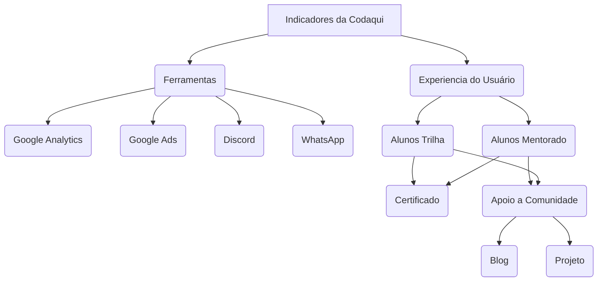
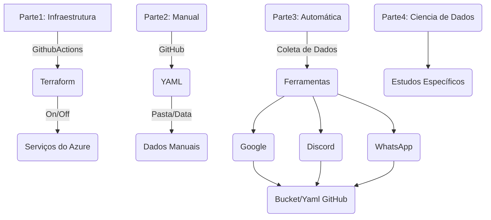

# Dados Codaqui

## Estrutura do Projeto

```text
.
|____terraform # Pasta para Arquivos de Infraestrutura
|____.editorconfig # Arquivo para Configurar Editores
|____README.md # Arquivo de Documentação
|____.github # Pasta para Arquivos de Configuração do GitHub
|____data
| |____manual.yaml # Arquivo de Dados Manuais
| |____automática # Arquivo que será commitado automaticamente
| | |____discord.yaml # Arquivo de Dados do Discord
| | |____whatsapp.yaml # Arquivo de Dados do WhatsApp
| | |____google.yaml # Arquivo de Dados do Google
```

## Indicadores



## Linha do Tempo




## Desenvolvimento/Colaboração

- [Conventional Commits](https://www.conventionalcommits.org/en/v1.0.0/)

## TODO

- [ ] Estudar Terraform (Básico)
  - [ ] Criar um Arquivo de Infraestrutura (main.tf)
    - Criar apenas um único arquivo, para no futuro dividir conforme a necessidade do projeto.
  - [ ] Criar um Arquivo de Variáveis (variables.tf)
  - [ ] Verificar os serviços que serão utilizados no Azure
- [ ] Configurar GitHub Actions Básica
  - [ ] Criar uma Action de Hello World para testar
    - [ ] Criar uma Action de Terraform para testar
    - [ ] Criar uma Action que faça o `plan` da infraestrutura
        - [ ] Usar um serviço de Storage da Azure para salvar os estados.
    - [ ] Criar uma Action que faça o deploy da infraestrutura
    - [ ] Criar uma Action que destrua a infraestrutura
- [ ] Coleta de Dados
    - [ ] Github Actions
    - [ ] Azure Functions
- [ ] Visualização de Dados
    - Decidir ferramenta para fazer a visualização dos dados.
- [ ] Ciência de Dados
    - Decidir ferramentas e serviços para fazer a ciência de dados.